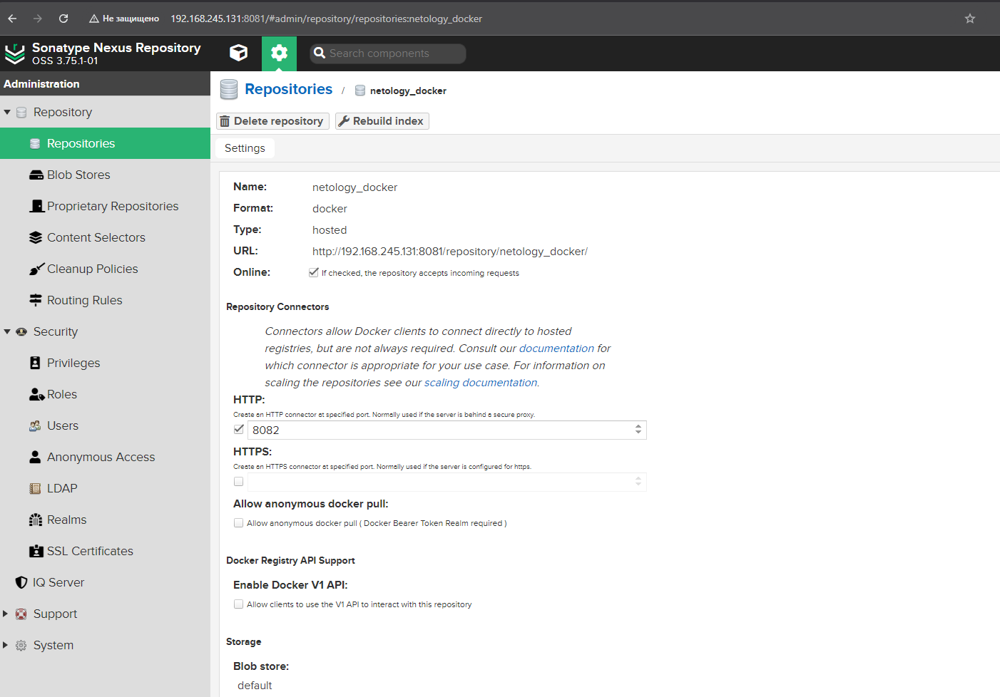

# Задание 1
### Настройки и результат выполнения

# Задание 2
### скриншоты с настройками проекта и результатами выполнения сборки

# Задание 3
### скриншоты с настройками проекта и результатами выполнения сборки

